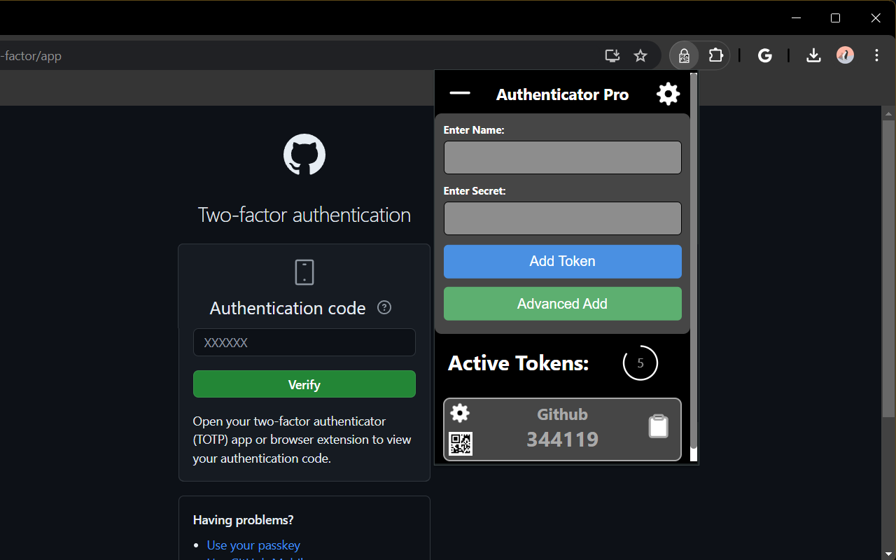
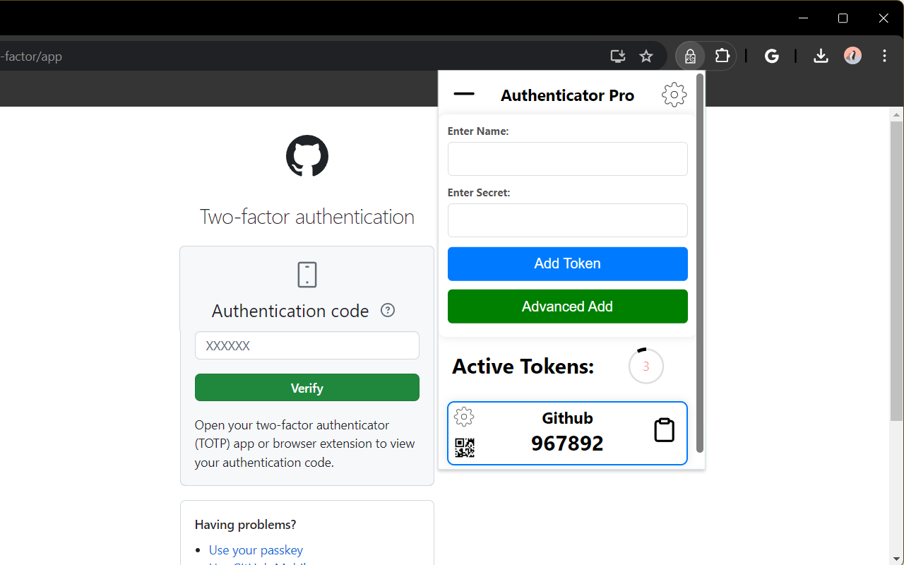

# Authenticator-Pro

Authenticator-Pro is a customizable authenticator extension that generates and autofills one-time passwords (OTPs) with various customization options.

## Features

- Generate OTPs for added security
- Autofill OTPs on specified websites
- Customize autofill URLs for different tokens
- Copy OTP to clipboard by clicking on token
- Display saved secrets as QR codes
- Add secrets via image URL, image file, or webcam QR code scan
- Dark and Light themes available

<h3>Dark Theme</h3>


<h3>Light Theme</h3>


## Work In Progress

- More themes
- More intuitive webcam permission popup

## Installation

1. Clone the repository:

   ```bash
   git clone https://github.com/Nuke1999/Authenticator-Pro.git
   ```

2. Navigate to the project directory:

   ```bash
    cd Authenticator-Pro
   ```

3. Install dependencies:

   ```bash
    npm install
   ```

4. Build the project:

   ```bash
   npm run build
   ```

5. Load the extension in Chrome:
   - Go to 'chrome://extensions'
   - Enable "Developer mode"
   - Click "Loan unpacked" and select the root of the project.

## Usage

- Open the extension popup by clicking on the Authenticator Pro icon in the Chrome toolbar.

- Add a new token by entering a name and a secret, then click "Add Token".

- Customize the autofill URL for each token by clicking the gear icon next to the token.

- Enable or disable autofill and copy to clipboard functionality in the settings menu.

- The extension will automatically update OTPs periodically.

## Acknowledgements

This project uses open-source dependencies that are licensed under the MIT license:

- otplib - OTP (One Time Password) library
- qr-scanner - QR code scanner library
- qrcode - QR code generation library
- feathericons - open-source icons

## Contributing

1. Fork the repository
2. Create a new branch for the feature or bug fix
3. Make changes
4. Commit changes
5. Push to the branch
6. Create a new Pull Request

## License

This project is licensed under the MIT License - see the LICENSE file for details.
