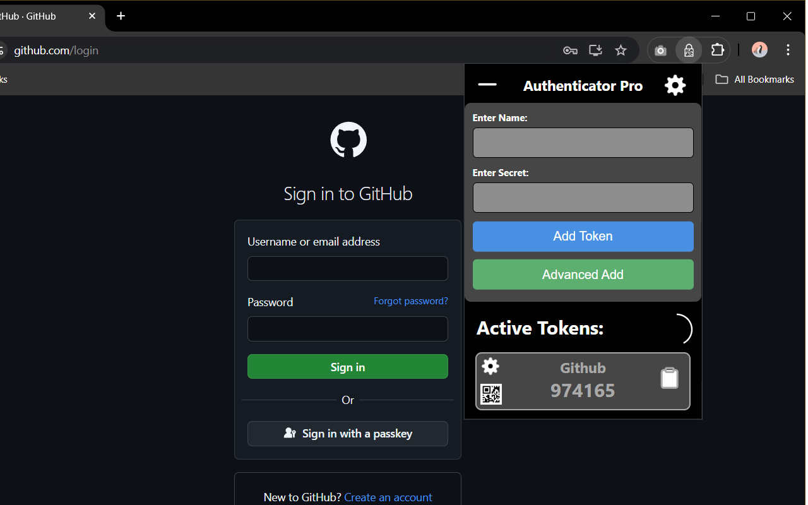
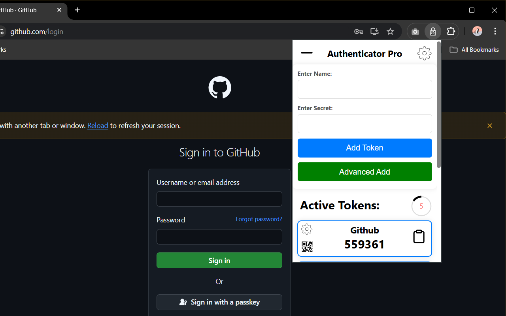

# Authenticator-Pro

Authenticator-Pro is a customizable authenticator extension that generates and autofills one-time passwords (OTPs) with various customization options.

## Features

- Add Secrets Easily: Add secrets via image URL, image file, or by scanning QR codes through the webcam with the Advanced Add Button.
- Autofill URL: Set unique URLs for each token to ensure OTP autofill works seamlessly across various websites via the token settings button.
- Bulk Add: Import multiple OTP entries at once (CSV or JSON) using the Bulk Add button—perfect for migrating from other authenticators or setting up lots of accounts quickly (please see documentation on Github for proper CSV/JSON formatting)
- Clipboard Copying: Enable OTP copying by simply clicking on a token, saving time on manual entry.
- Chrome Sync: Syncs tokens on logged-in Chrome devices.
- Scaling: Adjust the extension's interface between 70% and 130% of its original size for optimal visibility and usability across different screens.
- Online Time Sync: Synchronize with online time to ensure OTPs are accurately generated.
- Password Protection: Securely lock OTPs and secrets behind a password, allowing access only after correct password input.
- Popup Mode: Opens the extension in a separate popup window, providing quick and convenient access to OTPs.
- Themes: Choose from four themes - Light, Dark, Ocean, and Forest - to match your visual preference.
- Token Management: View, edit, and delete active OTP tokens within the extension.

<h3>Dark Theme</h3>


<h3>Light Theme</h3>


## Installation

1. Clone the repository:

   ```bash
   git clone https://github.com/Nuke1999/Authenticator-Pro.git
   ```

2. Navigate to the project directory:

   ```bash
    cd Authenticator-Pro
   ```

3. Install dependencies:

   ```bash
    npm install
   ```

4. Build the project:

   ```bash
   npm run build
   ```

5. Load the extension in Chrome:
   - Go to 'chrome://extensions'
   - Enable "Developer mode"
   - Click "Load unpacked" and select the root of the project.

## Build / Refactor Notes

- The extension source lives in `src/` (modularized popup/settings/auth/etc.).
- Production builds output to `dist/`, and the popup loads `dist/popup.js`.
- Refactor note (Feb 2026): codebase was reorganized to support a `dist/`-based production layout and smaller modules.

## Usage

- Open the extension popup by clicking on the Authenticator Pro icon in the Chrome toolbar.

- Add a new token by entering a name and a secret, then click "Add Token".

- Customize the autofill URL for each token by clicking the gear icon next to the token.

- Enable or disable autofill and copy to clipboard functionality in the settings menu.

- The extension will automatically update OTPs periodically.

## Bulk Add (CSV / JSON Format)

Bulk Add lets you import multiple tokens at once from a CSV file or a JSON file.

**CSV**

- Required columns: `name`, `secret`
- Optional column: `url` (used for Autofill URL matching)

Example (with headers):

```csv
name,secret,url
GitHub,JBSWY3DPEHPK3PXP,https://github.com
Google,GEZDGNBVGY3TQOJQGEZDGNBVGY3TQOJQ,https://accounts.google.com
```

Notes:

- A header row is supported. Common header variants like `account`/`label`/`issuer` (for `name`), `key`/`totp secret` (for `secret`), and `site`/`website`/`autofill url` (for `url`) are accepted.
- If your CSV includes an `otp`/`code` column, it will be ignored (OTPs expire and are not imported/exported).
- Secrets must be valid Base32 (A-Z and 2-7). Whitespace is tolerated, but invalid secrets will be rejected.

**JSON**

Accepted formats:

```json
[
  { "name": "GitHub", "secret": "JBSWY3DPEHPK3PXP", "url": "https://github.com" },
  { "name": "Google", "secret": "GEZDGNBVGY3TQOJQGEZDGNBVGY3TQOJQ", "url": "https://accounts.google.com" }
]
```

Or:

```json
{
  "tokens": [
    { "name": "GitHub", "secret": "JBSWY3DPEHPK3PXP", "url": "https://github.com" }
  ]
}
```

Rules:

- `name` and `secret` are required; `url` is optional.
- Entries with missing/invalid secrets are rejected.
- Duplicates are skipped if the `name` or `secret` already exists.

## Acknowledgements

This project uses open-source dependencies that are licensed under the MIT license:

- otplib - OTP (One Time Password) library
- qr-scanner - QR code scanner library
- qrcode - QR code generation library
- feathericons - open-source icons

## Contributing

1. Fork the repository
2. Create a new branch for the feature or bug fix
3. Make changes
4. Commit changes
5. Push to the branch
6. Create a new Pull Request

## License

This project is licensed under the MIT License - see the LICENSE file for details.


